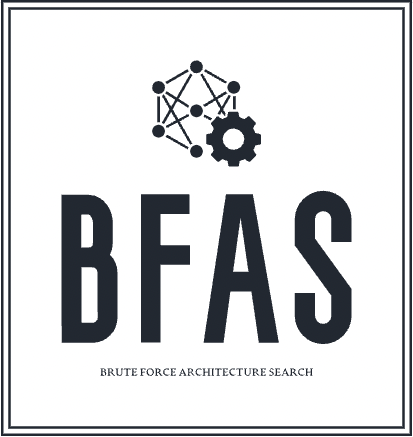
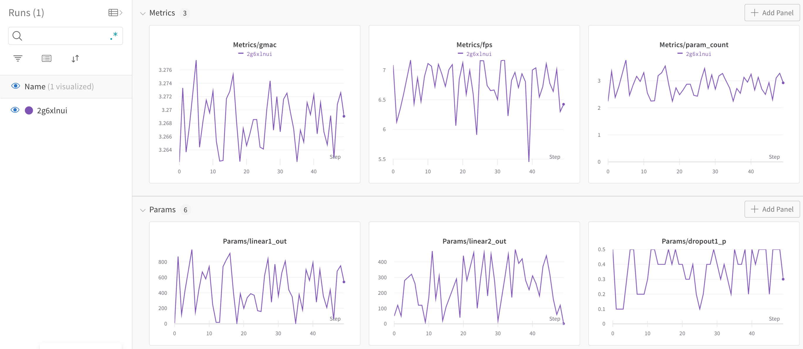

# BFAS
Brute Force Architecture Search
<br>
<p align="center">

</p>

*This repository aims to find neural network architecture that shows best performance on your hardware.* 

<br>

## Description

1. **Architecture file (archname.py)**

This file contains your neural network architecture. It has Net (torch.nn.module) and the net takes your variables as arguments.

2. **Variables file (archname.json)**

This file contains information about your variables that in your neural network. We define 2 types variable as "range", "array". The range variable have start, end and step values. This type variables can have range of values. The array variable have a list of item. In parameter sampling process, parameters sampled from this array.

3. **Application file (app.py)**

In this file, you can create your bfas experiments. It contains codes like;

```python
from bfas import BFAS
from bfas.utils.data_types import *

bfas = BFAS(project_name="bfas",
            archname="mobilenetv2_custom",
            archs_dir = "archs",
            device="cpu",
            logger_name="tensorboard",
            is_logging_active=True,
            seed=28,
            )

bfas.rules.addRule(Rule(Metrics.FPS, Limit.MIN, 1))
bfas.rules.addRule(Rule(Metrics.PARAMCOUNT, Limit.MAX, 10))
bfas.run(iter_count=5)
```
Here, We import the BFAS module and related data_types such as Rule, FPS metric etc. After that, We create BFAS object with necessarly arguments. Then, We add the rules for "brute force architecture search" process. If the model can suitable to our rules, we can add this model and their parameter to our logs. This rule adding step is optional. If you don't add any rule, all resulst are going to save to logs. The last operation is run the experiments. You can set iteration count before the running the experiment.

>**Note**
>If you want see detailed information about creating environment and designing your experiment, You can look at [guide](docs/guide.md).

Wandb logging example here:
<p align="center">

</p>


>**Note**
>You can see our development plan and open tasks for this project from [todo](docs/todo.md) document .
## Contributing

Contributions are what make the open source community such an amazing place to be learn, inspire, and create. Any contributions you make are **greatly appreciated**.

1. Fork the Project
2. Create your Feature Branch (`git checkout -b feature/AmazingFeature`)
3. Commit your Changes (`git commit -m 'Add some AmazingFeature'`)
4. Push to the Branch (`git push origin feature/AmazingFeature`)
5. Open a Pull Request


